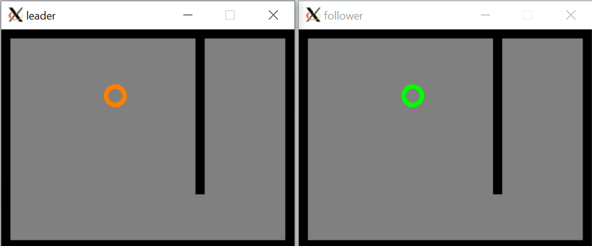

# Lab 3 - Robot Operating System (ROS) Basics
## ECE-CSE 434 - Automated Vehicles
## Contents
* [Introduction](#Introduction)
* [Create a Workspace and Lab 3 Folder](#create-a-workspace-and-lab-3-folder)
* [Exercise 1: A Minimal Package](#exercise-1-a-minimal-package)
* [Exercise 2: A Publisher-Subscriber Package](#exercise-2-a-publisher-subscriber-package)
* [Exercise 3: A Follow-the-Leader Package](#exercise-3-a-follow-the-leader-package)

# Introduction
In this Assignment you will create a number of ROS packages.  These include a minimal package a publisher and subscriber package and finally a leader and follower package.  

Start by reading [Section 3.1 of AV_23: Start Programming with ROS 2](https://gitlab.msu.edu/av/av_23#3-ros-notes).


# Create a Workspace and Lab 3 Folder
While it is not required, we recommend you locate your workspace in the folder: `~/av/ros_ws`, and the explanation here will assume you are doing that.  

If you have not already done so, create your workspace with a `src` folder as follows: 
```
R:~$ mkdir -p ~/av/ros_ws/src
```
Then either copy your `<student_repo>` into this folder or just clone it there.

Since this is Lab 3, create a folder called `lab3_nodes` inside your `<student-repo>`:
```
R:~$ cd ~/av/ros_ws/src/<student_repo>
R:~/av/ros_ws/src/<student_repo>$ mkdir lab3_nodes
```
where `<student_repo>` should be replaced by the actual name of your repo.  In the following exercises you will create three ROS packages in the `lab3_nodes` folder.

# Exercise 1: A Minimal Package

First, create a minimal package called `my_package` with a single node called `my_node`.  To do this follow the *Python* instructions in this [tutorial](https://docs.ros.org/en/humble/Tutorials/Beginner-Client-Libraries/Creating-Your-First-ROS2-Package.html). Make the following modifications in order to create your package in the workspace you have just set up:
* Run the `ros2 pkg create` function in your `<student_repo>/lab3_nodes` folder, rather than in `ros_ws/src` as the turtorial indicates.
* Run `colcon` from the top-level of your workspace which is `~/av/ros_ws`.

After you are done this tutorial, you will have a folder `<student_repo>/lab3_nodes/my_package` that contains this minimal package.  Your `install`, `build` and `log` folders will be in `~/av/ros_ws`.  That's the end of exercise 1.

# Exercise 2: A Publisher-Subscriber Package

Next, create a Python ROS package with a publisher node and a subscriber node, as detailed in this [tutorial](https://docs.ros.org/en/humble/Tutorials/Beginner-Client-Libraries/Writing-A-Simple-Py-Publisher-And-Subscriber.html).  The publisher and subscriber classes are templates for you to build on in creating other nodes, so make sure you understand how each line of the code works, as well as how the configuration files work.  As in Exercise 1, create your package in your `<student_repo>/lab3_nodes` folder, and run `colcon` from the top level of your workspace.  

# Exercise 3: A Follow-the-Leader Package

Consider a follow-the-leader scenario.   In room-A there is robot-A that you can command to move around.  In an identical room-B there is another robot-B that attempts to copy the motion of robot-A.  This exercise is to create a follow-the-leader package that simulates a leader and a follower robot.  

You are provided with three Python code files to get you started:
 * `robot_room.py`: This is a utility class that takes care of drawing a room, drawing a robot, listening to the keyboard for commands, and moving the robot based on commands and its room location.  Do not change this code.
 * `leader.py`: This is a ROS node that simulates the leader robot called Robot-A.  Robot-A is controlled by the keyboard.  Additionally the motion commands are published to a `robot_move` so that the follower robot can copy the leader. 
 * `follower.py`: This is a ROS node that subscribes to `robot_move` and moves the follower robot, Robot-B, according to the commands it reads from this topic.

## Topic Type for Follow-the-Leader

If you have looked into the functions for Publisher-Subscriber, you may notice that the publisher publishes a `String` message and the subscriber receives a `String` message.
However, for Follow-the-Leader, the leader should publish an `Int32` message and the follower should subscribe to an `Int32` message.
Make sure you pass the appropriate argument that specifies the topic type when specifying your publisher and subscriber.

## Create the Package
Start by using `cd` in the terminal to go to your `<student_repo>/lab3_nodes` folder.  Then create a package called `lead_follow` with:
```
R:~/av/ros_ws/src/<student_repo>/lab3_nodes$ ros2 pkg create --build-type ament_python lead_follow 
```
Next you can copy your provided Python code into the code folder: `lead_follow/lead_follow` where you will also see a `__init__.py` file.  Complete the missing sections in `leader.py` and `follower.py`, as well as set up the configuration files as done in the previous exercises.  

## Build the Package
To build your package, use `colcon` from the top level of your workspace (namely in `~/av/ros_ws`):
```
R:~/av/ros_ws$ colcon build  --symlink-install --packages-select lead_follow
```
Note that using the `--symlink-install` option will create symbolic links in the install package that point to your original code.  That way you can make changes to your Python code and these changes will automatically update the installed package.  Without the `--symlink-install` option, every time you make changes to your code you would need to re-build the package using `colcon` before you ran it.

## Run the Nodes

After building, first source your overlay which will add your package to ROS's internal path:  
```
R:~/av/ros_ws$ source install/setup.bash
```
Then run your leader with the command:
```
R:~$ ros2 run lead_follow leader
```
Note: as long as you have sourced the overlay, you can call the `ros2 run <package_name> <node_name>` command from anywhere inside or outside your workspace. 

In another terminal you will run your follower by first sourcing the overlay and then calling:
```
R:~$ ros2 run lead_follow follower
```

Here is what the leader and follower windows may look like like:



Click on the **leader** window and use the indicated keys to direct the robot to move around using keystrokes.  OpenCV will only read in the keyboard keys if the graphical window is selected.  When your code is working, you should see the follower robot copy the motions of the leader.  Also, when you press `q` in the leader window, both nodes should quit cleanly.

# Submitting this lab
Your code should all be inside the `<student_repo>/lab3_nodes` folder.  To submit do:
```
cd <student_repo>/lab3_nodes
git add .
git commit -m "Add a comment here"
git push
```
Do not forget to `push`, or your lab will not be submitted.


