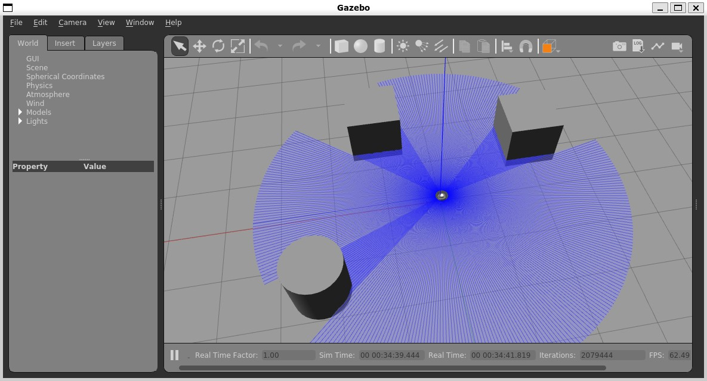
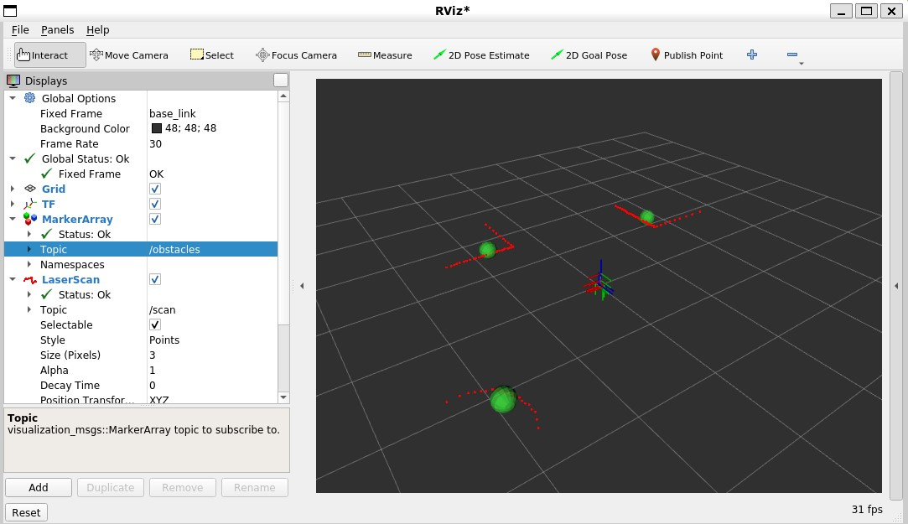
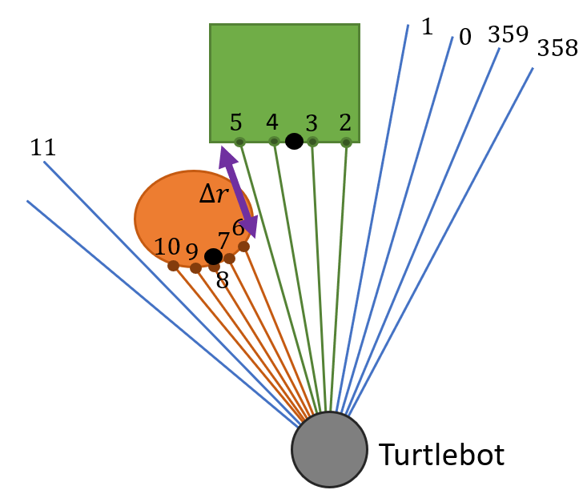

# Lab 7: Mapping
## ECE-CSE 434

# Exercise 1: Obstacles in lidar
Lidar is a very useful sensor for navigation including finding obstacles.  In this exercise we will investigate clustering as a means to partition the nearby world into obstacles. Your task is to convert a lidar scan into a collection of obstacles and visualize the obstacles in RViz.  This exercise will be done using Gazebo on HPCC.  

Create a ROS package called `bot_map` and use the provided code `obstacles.py` as a starting point for your ROS node. The code shows how to subscribe to laser returns, turn them into 2D or 3D points, and how to publish detected obstacles as spherical marks that can be viewed in RViz.  Your task is to complete the point processing that clusters lidar points into obstacles.  You will then create a block world in Gazebo with some obstacles like this around the Turtlebot:



Use an emtpy world model with Gazebo and the Turtlebot3 robot:
```
ros2 launch turtlebot3_gazebo empty_world.launch.py
```
Add a collection of obstacles around your robot.  Then run your code with:
```
ros2 run bot_map obstacles
```
Visualize the output, in RViz, and you should see something like the below with a sphere marker at the centroid of each obstacle:



Note that in RViz you'll need to add the various topics indicated in the figure in order to see the above.  Make sure to select `base_link` in the `Fixed Frame` line of `Global Options`.  For the `LaserScan`, select style `Points` for better visibility.  Your detected obstacle centers should show up using the `MarkerArray` topic and setting its topic as `/obstacles`

Now, you will need to decide what algorithm to use for clustering.  Consider the below diagram showing a set of lidar rays each having a `range` that specifies how far away the object is along that ray.  The black dots are the centroids of the visible points on the obstacle.



One way to cluster obstacles is to do connected components, where sequentially adjacent points are connected if the difference in their ranges is small.  In the above example, there are two objects modeled with two connected components and the difference in range between points `5` and `6`, labeled `Delta r`, is greater than a threshold `T`, resulting in points `5` and `6` being disconnnected.  

Here is how to implement this.  The Lidar rays are scanned every one-degree interval in azimuth.  For each point with index *i*, consider its left neighbor with index *i+1*.  If the range (or length of the ray) *i+1* is close to the range of point *i*, then declare *i* and *i+1* are on the same object.  Of course, exclude all points with range 0 or range infinity.  In comparing ranges, you can use a threshold `T` of 0.25 meters.  Now, each point also has its own $x$ and $y$ coordinates.   Starting at the first valid point (above would be point 2), you can create an obstacle and start summing the $x$ and $y$ coordinates until you find a point not on the obstacle, here point 6.  Then divide the cumulative sum of $x$ and $y$ by the number of points on the obstacle (4 for the green obstacle), and you'll get the centroid of the obstacle points. Store the centroid in a list and repeat until you have iterated through all points.  Also, be careful about wrapping abound from the last to first point, as those may be on the same obstacle or not.

You can navigate your Turtlebot with the `teleop_twist_keyboard` package and node:
```
ros2 run teleop_twist_keyboard teleop_twist keyboard
```


# Exercise 2: SLAM + Navigation

This exercise will explore mapping and navigation using your physical Turtlebot4.  After you have completed Exercise 1, commit and push it.  Then clone your repo into a ROS workspace in an Ubuntu instance on your laptop.  

*(a)* Make sure your Turtlebot is running and your have Ubuntu running also running and connected to the `turtlebot5` network.  Ensure the `ROS_DOMAIN_ID` in your Ubuntu shell is the same as your Turtlebot ID.  Build and run your obstacle detector from Exercise 1.  Start RViz2 in your Ubuntu environment and then add and make sure you can see the lidar scans and the obstacles that your code detects.

*(b)* Follow the [SLAM tutorial](https://turtlebot.github.io/turtlebot4-user-manual/tutorials/generate_map.html) to create a map around your robot.  Make sure you have some static obstacles that you drive around.  Save your map as `map_name.pgm` and `map_name.yaml` in the `lab8_maps` folder.

*(c)* Follow the [Navigation tutorial](https://turtlebot.github.io/turtlebot4-user-manual/tutorials/navigation.html).  This will use the map you just created in *(b)*.  You should be able to specify a target pose for your robot and have it navigate to that location.  Make a screen capture of the navigation map as the robot navigates to its target pose.  Save this capture as an image `nav_map.png`.

Note: while you specified a target pose manually, it is not too hard to write a ROS node to specify the target.  We'll do that in a future lab.

# Submit

As usual, submit your code by pushing your `<student_repo>` with everything in a folder called `lab7_maps`.  Each person in your team should write her/his own code, and submit her/his own solution.  You can discuss your strategies and how to solve it, but write your own code.  Also each person control do the SLAM and navigation individually.


