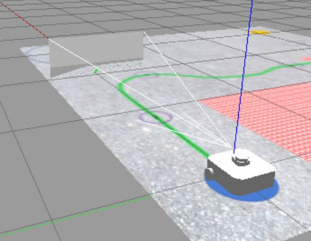
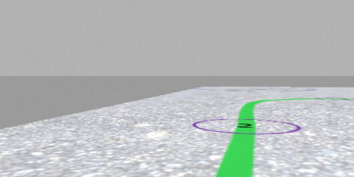
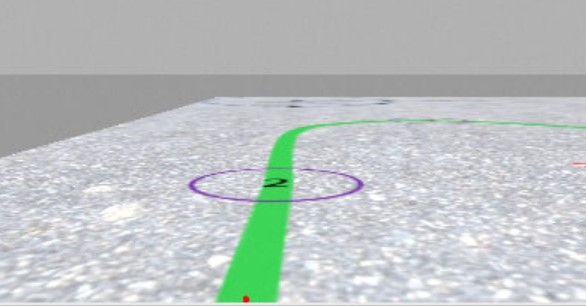
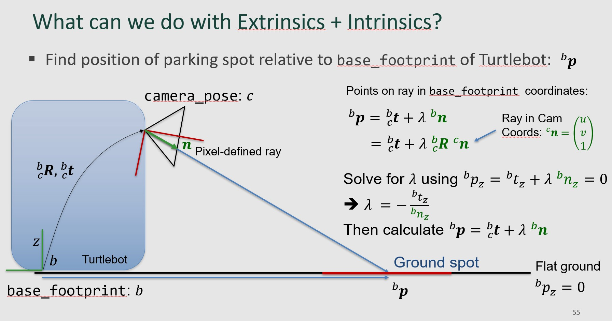
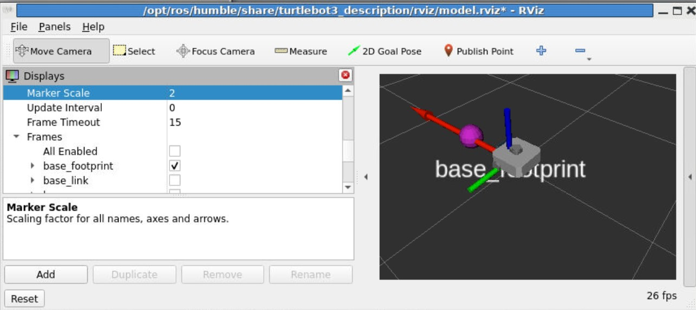

# Lab 8: Line Detection
## ECE-CSE 434

A basic feature of any autonomous vehicle is the ability to stay in a lane while driving along a road.  Labs 8 and 9 will develop a simplified form of lane following in which a Turtlebot detects a line on the ground, that indicates the center of the lane, and follows it.  Lab 8 focuses on the line detection task, while Lab 9 will do line following.  Lab 8 will be done in Gazebo, and can be done on the HPCC.

Start by cloning [GreenLine 2 World](https://gitlab.msu.edu/av/greenline2) into your workspace src folder, such as: `~/av/ros_ws/src/`.  Do **not** download it into your `<student_rep>` folder.  Then build it and run it.  Do not forget to switch to the `waffle` Turtlebot, as this has a camera on it.
```
source install/setup.bash
tbot waffle
ros2 launch greenline2 greenline2.launch.py
```


Create a folder `lab8_line` in your `<student_repo>` and inside this create a ROS2 package called `line_detect`.  

# Exercise 1: Line Detection

You can view the image with `rqt` or with Rviz.  An example is this:



We will use color to distinguish the line from the rest of the ground texture.  The question is how to find a suitable rule for distinguishing the green line pixels from other pixels?  If you recall, that is what our logistic regression classifier did.  So for this exercise your task is to build a logistic regression classifier for finding line pixels in an image.  You are free to use the code from Lab 5 for this.  

First, to train your logistic regression model you will need an image with the lane visible.  You can use the image `train.png` in the `images` folder.    Then you will need a mask.  Use the provided code `labeler.py` to create a mask called `train_mask.png` that segments line pixels from background texture.  Now train your logistic regression classifier with this image and mask.   Print out your fitted model containing 4 parameters: the intercept and `cvec`, a 3-vector orthogonal to the hyperplane.  Store these in a text file: `green_classifier.txt`

Next, let's test its performance.  Run your logistic regression classifier on `test.png` and output a probability image `test_prob.png`.  Make sure the output probability is high for lane pixels and low for other pixels.  

Add the following to the `images` folder: 
* `train_mask.png`
* `test_prob.png`

# Exercise 2: Detect the Line

Create a Python node called `detect.py` in your `line_detect` package.  Initially, it should subscribe to the compressed image topic from the Turtlebot and display the video in a window.  Run it with:
```
$ ros2 run line_detect detect
```
Make sure it is working by driving your Turtlebot around and confirming the image matches the scenery. 

When you implement a line follower, you will actually only need one point on the line.  The best point will be the nearest point to the vehicle, which is where the line intersects the bottom of the image.  The next step is to update your `detect.py` code to add line-detection.

In your image-topic callback function in `detect.py`, extract the bottom 5 rows of pixels and apply logistic regression-based green line detection to get probability of line for each pixel.  (You can hard-code the 4 logistic regression parameters you found in Exercise 1.)  This will produce a strip of the same size that the image strip, with a blob of high-probability values where the green line intersects the image strip.  Threshold and find the pixel coordinates of the centroid of the largest blob in the image strip.  Next, convert these coordinates to full image coordinates.  Then draw a red dot on the full image at the detected line location.  The displayed image should now have a red dot near the bottom where the green line is detected.  Note: if there is no green line visible on the bottom of the image, your code should not display any dot.




Finally, add a publisher for the detected point using a `PointStamped` topic.  This is a `Point` message along with a `Header`, see [here](http://docs.ros.org/en/noetic/api/geometry_msgs/html/msg/PointStamped.html).  The reason for including the header is to enable the point to be associated with the original image using a frame index and/or time-stamp, and also to pass timing data for use in any processing that needs time information.  Use the same header as obtained from the image topic -- that way it will have the same time-stamp and index.  For the `Point` component, let the `x` and `y` elements correspond to the horizontal and vertical coordinates of the pixel measured from the top-left of the image.  In the case when no line is detected, simply set all elements to zero.  Publish this `PointStamped` to a topic called `line_point`.  

Check that your code is publishing correctly by echoing the `line_point` topic:
```
ros2 topic echo /line_point
```


## Making Virtual Environments Accessible to ROS
In Exercise 2, if you import logistic regression, that will import `sklearn`, which you should have added to your virtual environment.  Normally you activate the environment to make its libraries available to Python code.  However, when running code with `ros2 run`, the active environment is not available.  To make it available, you need to add the virtual environment to the `PYTHONPATH` environment variable.  There is a function defined in your `.rosinit` file that will do this called `addpypath`.  If your virtual environment is `av`, then to make it available type:
```
addpypath av
```
If you don't do this, you'll likely get an error like this:
```
  File "/mnt/home/dmorris/av/ros_ws/build/line_detect/line_detect/detect.py", line 13, in <module>
    from .logist_reg import LogisticReg
  File "/mnt/home/dmorris/av/ros_ws/build/line_detect/line_detect/logist_reg.py", line 19, in <module>
    from sklearn.metrics import average_precision_score
ModuleNotFoundError: No module named 'sklearn'
[ros2run]: Process exited with failure 1
```


# Exercise 3: Ground Spot

An image pixel defines a vector from the camera optical center through the pixel.  In this exercise we use the vector defined by the `line_point` pixel from Exercise 2.  We can extend this vector from the camera to the ground, and where this ray intersects the ground is the actual location of line.  In Lab 9 we will use the this ground point for navigation such as line following, but here we just need to locate this ground point relative to the robot.  The below figure shows them math from this from the lecture in Week 6:



The code `ground_spot.py` is a ROS node that subscribes to `line_point` and calculates the ground location and publishes this.  Your task is to complete the portion of this code that calculates the ground spot using the formulas in the above figure.  Your code should run with:
```
ros2 run line_detect ground_spot
```

View the ground spot with Rviz.  If you want the 3D Turtlebot model, make sure you have the `waffle` selected:
```
tbot waffle
```
and use this to start Rviz:
```
ros2 launch turtlebot3_bringup rviz2.launch.py
```
Then add the `ground_spot` topic, and you should see a purple dot at the ground spot in front of the Turtlebot:




# Submit

Submit the following in `<student_repo>/lab8_line`: 
* `green_classifier.txt`
* `train_mask.png`
* `test_prob.png`
* ROS package `line_detect` containing `detect.py` and `ground_spot.py`

